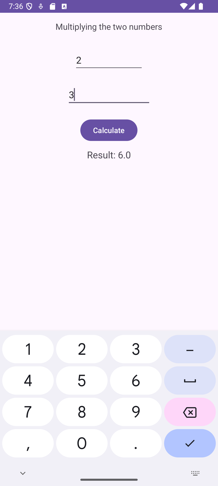

# CodeMath

CodeMath is a simple Android utility app that performs calculations based on user input. In this initial version, the app multiplies two numbers entered by the user. The app includes required and additional features, making it both functional and user-friendly.

## Overview

The goal of CodeMath is to demonstrate how to build a basic utility app with interactive elements and ViewBinding. It takes inputs from the user, performs a calculation, and displays the result in real time.

## Features

### Required Application Features

- **User Input**: Accepts two numerical inputs via `EditText` fields.
- **Interactive View**: A `Button` is provided to manually trigger the calculation.
- **Output Display**: The result of the calculation (multiplication of the two inputs) is displayed using a `TextView`.

### Stretch Features

- **ViewBinding**: Implemented to reduce boilerplate code and improve code efficiency.
- **Automatic Calculation**: Results are updated automatically as the user types in either of the input fields using `addTextChangedListener`.
- **Calculation Information**: An additional `TextView` informs the user of the calculation being performed ("Multiplying the two numbers").

## Screenshots
*Screenshot showing the app's main interface with inputs and result display.*

